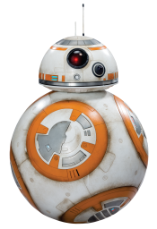

<h1>JY-8 : Integrated AVR controller</h1>

*Atmel Studio Project*



ATMega128A MCU에서 다양한 Sensor, Actuator 를 다루기 위해 Atmel Studio 환경에서 짜여진 코드입니다.   
ATiny와 같은 작은 메모리의 AVR MCU에서는 구동되지 않습니다.

<h2>Project details</h2>

|||
|---|---|
|Period|2016.01 ~ 2016.03|
|Team|None|

|Tech|Detail|
|---|---|
||Main algorism|
||Embeded MCU|

<h2>Included Features</h2>

<h3>Sensor</h3>

* HC_SR04
* MPU6050
* All sensors using ADC (Analog-to-digital converter)

<h3>Sensor Filter</h3>

* Low-pass & High-pass filter
* Kalman filter 1D & 2D

<h3>Actuator</h3>

* DC Motor
* Servo Motor
* Buzzer & Speaker (support playing MIDI string)

<h3>Integrated Controller</h3>

* Queue based flow controller
* 4-DOF Robot arm controller
* Driving controller (with 2 DC motor)

<h3>3rd Party Features</h3>

* Software I2C protocol
* Software UART protocol

<h2>Class Structure</h2>

```class structure
CFlowManager        비동기적으로 입력되는 명령들을 Event Queue로 처리합니다.
CDCController       DC motor를 제어합니다.
CServoController    Servo motor를 제어합니다.
CSoundController    Speaker, Buzzer를 제어합니다.

CCarMovement        2개 DC motor를 변수로 갖고 전진/후진/회전을 처리합니다.
CArmMovement        4개의 Servo motor를 변수로 갖고 로봇팔 기능을 수행합니다.
CEtcMovement        1개의 Servo motor를 변수로 갖고 기타 움직임을 처리합니다.

CPerception         아래의 Sensor들을 멤버 변수로 갖고 제어합니다.
CSensorBase         각종 Sensor에 공통적으로 쓰이는 기능을 가집니다. 
┣━ CMPU6050         MPU6050 Acc&Gyro sensor를 제어합니다.
┣━ CHCSR04          HCSR04 supersonic sensor를 제어합니다.
┗━ CSimpleADC       ADC를 사용하는 기타 sensor를 제어합니다.
```

<h2>Customization</h2>

본 repository 코드의 일부 참고가 아닌 전체를 활용하고자 한다면, 본 코드는 완성된 JY-8 로봇에 맞춰져 있으므로, 타 로봇에 적용하기 위해 다음의 Customization이 필요합니다.
<br/><br/>
Core/DefinedEvents.h

* FlowManager에서 쓰이는 GolbalEvent의 종류와 에러코드가 정의되어 있으므로 로봇에 필요한 GolbalEvent와 에러코드를 재정의하여야 합니다.

Core/Perception

* 로봇에 사용되는 센서 종류를 재정의하고, 구현하여야 합니다.

JY-8.cpp

* main function, timer를 적절히 재구현하고 각 sensor, actuator 들에 올바른 pin을 지정해주어야 합니다.
